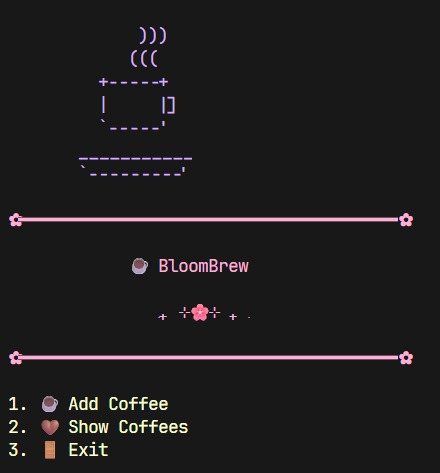
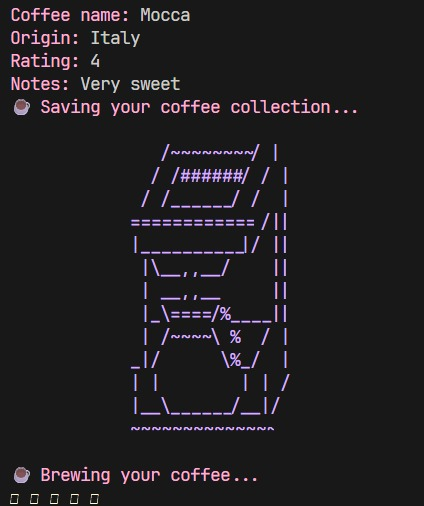
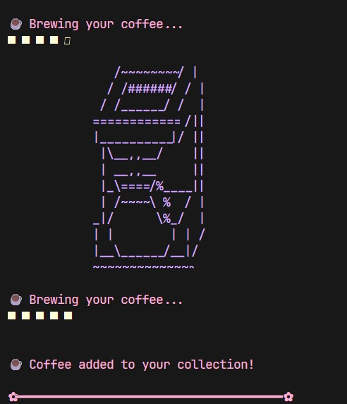
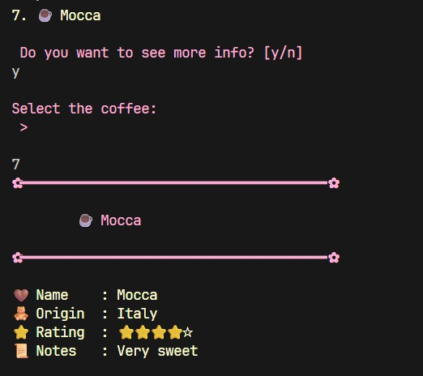

<div align="center">

<h1>🌸 BloomCode BloomBrew README🌸</h1>

<p><em>🌸 Second project of the BloomCode collection. 🌸</em></p>

</div>

---

<div align="center">

# ⌞📎⌝ BloomBrew

### • Modern C++ • BloomCode

*A cozy terminal coffee tracker built with Modern C++.*

Part of the **🌸 BloomCode** collection.

</div>

---

| 📌 | |
|:---|:---|
| **Language** | C++23 |
| **Build System** | CMake |
| **Platform** | Linux / WSL |
| **Difficulty** | ⭐ Beginner |
| **Status** | ✅ Complete (v1.0) |

---

## 🌸 About

BloomBrew is a cozy terminal application written in Modern C++ that lets you build your own personal coffee journal.

The project was created as a beginner-friendly exercise to practice the fundamentals of C++ while building a polished console application that persists data between sessions.

During development I focused on working with object-oriented programming, file handling, modular project architecture, and creating a cozy user experience through ANSI colors, ASCII art, animations and clean terminal menus.
---

## 🎨 Color Palette

<p align="center">

| Role    | Color                                                                                                             |
|---------|-------------------------------------------------------------------------------------------------------------------|
| Header  | <span style="display:inline-block;width:20px;height:20px;background:#FF9FCF;border-radius:4px;"></span> `#FF9FCF` |
| Menus   | <span style="display:inline-block;width:20px;height:20px;background:#C8A2FF;border-radius:4px;"></span> `#C8A2FF` |
| Success | <span style="display:inline-block;width:20px;height:20px;background:#A8E6CF;border-radius:4px;"></span> `#A8E6CF` |
| Options | <span style="display:inline-block;width:20px;height:20px;background:#FFF6E5;border-radius:4px;"></span> `#FFF6E5` |

</div>
---

## 🌻 Concepts Practiced

- Classes and Object-Oriented Programming (OOP)
- Constructors and member initializer lists
- Encapsulation (getters & setters)
- std::vector
- File I/O (ifstream / ofstream)
- String parsing with std::stringstream
- Modular project architecture
- Header/source file organization
- CMake build system
- Terminal UI design

- C++23
- STL
- CMake
- File Streams
- String Streams
- ANSI Escape Codes

---

## ⌞📃⌝ Features

- ☕ Add coffees
- 🤎 Browse your coffee collection
- ☕ Star ratings
- 🤎 Personal tasting notes
- ☕ Automatic save/load
- 🤎 Cozy terminal UI
- ☕ Cute ASCII art
- 🤎 Brewing animation

---

<p align="center">

## ⌞📸⌝ Preview

### Main Menu



### Add Coffee



### BrewingAnimation



### CoffeeCard



</p>

---

## ⌞⚙️⌝ Build

### Requirements

- C++23
- CMake 3.20+
- Git

### Clone

```bash
git clone https://github.com/LuciaYSeApago/cpp-bloom-brew.git
```

### Build

```bash
mkdir build
cd build

cmake ..

cmake --build .
```

### Run

```bash
./ProjectName
```

---

## ⌞📖⌝ Project Structure

```text
project-name/
│
├── assets/
├── docs/
├── include/
├── screenshots/
├── src/
│
├── CMakeLists.txt
├── README.md
└── LICENSE
```

---

## ⌞🚀⌝ Future Ideas

- [ ] Edit existing coffees
- [ ] Delete coffees
- [ ] Search by name
- [ ] Filter by origin
- [ ] Sort by rating
- [ ] Mark favorite coffees
- [ ] Export collection

---

## 🌸 BloomCode Philosophy

This project follows the BloomCode Design System.

- 🌸 Cozy
- 💖 Cute
- ✨ Clean
- 🌱 Growth
- 🎮 Playful
- 💻 Modern C++


---

## 📄 License

Released under the MIT License.